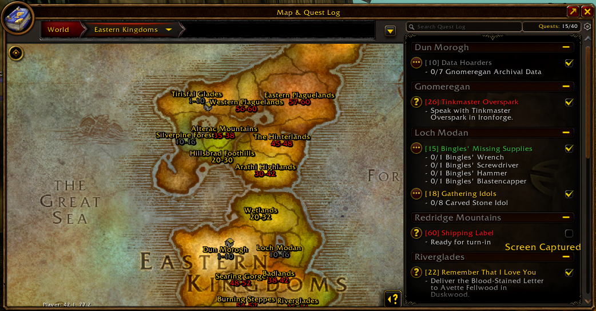
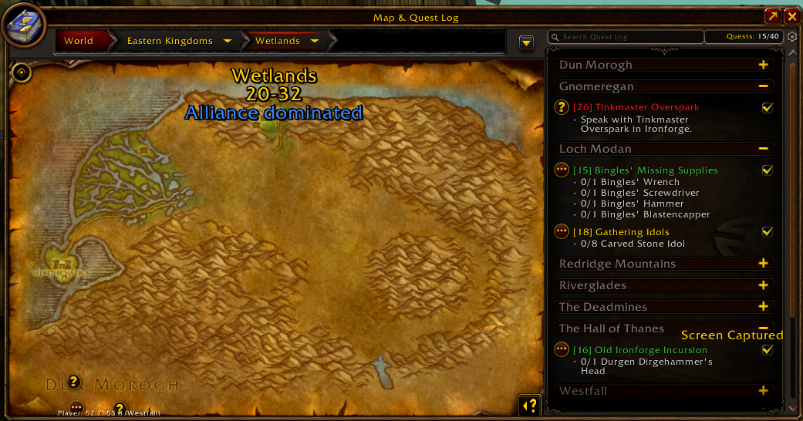

# ZoneLevelsForever

World of Warcraft Forever addon that shows recommended level ranges for each zone on the world map.

## Features

- Labels on the continent maps (Kalimdor, Eastern Kingdoms), with each zone's name and level range in the middle of the zone.
- A label at the top of a zone's own map (hidden while Blizzard shows its own zone name there as you hover the map), with an extra line when the zone is Alliance dominated (blue), Horde dominated (red) or Neutral (light blue, e.g. Moonglade).
- The level range is coloured by difficulty relative to your level (grey/green/yellow/orange/red), the same way Blizzard colours zone labels. It updates when you level up.
- Your own faction's levelling guide is used. Zones that are only in the other faction's guide (e.g. The Barrens for Alliance) use that faction's range, so every zone gets a label.
- A round map button in the top-right corner of the world map toggles the continent labels. When they're off, a zone's label only shows while you hover the zone.
- Labels stay the same size on screen at every map zoom level, with separate sizes for continent and zone maps.
- A settings window that stays open next to the world map, so you see every change on the map right away. Open it from the AddOns menu by the minimap, by right-clicking the map button, or from Options.
- The same settings under **Options → AddOns → ZoneLevelsForever**.
- Reset every setting to the defaults in `Config.lua` with one button.





Example label on the Swamp of Sorrows zone map:

```
Swamp of Sorrows
38-40
Horde dominated
```

## Installation

Copy the `ZoneLevelsForever` folder to the `Interface/AddOns/` folder of your WoW Forever client and restart the game.

## Commands

| Command                                      | Description                                                              |
| -------------------------------------------- | ------------------------------------------------------------------------ |
| `/zonelevels`                                | Print the levelling guide for your faction                               |
| `/zonelevels alliance` / `/zonelevels horde` | Print the guide for a specific faction                                   |
| `/zonelevels toggle`                         | Toggle the continent labels between always shown and shown on hover      |
| `/zonelevels options`                        | Open or close the settings window                                        |
| `/zonelevels reset`                          | Reset every setting to the values in `Config.lua`                        |
| `/zonelevels scale`                          | Show the current label sizes                                             |
| `/zonelevels scale continent <0.5-5>`        | Set the label size on the continent maps                                 |
| `/zonelevels scale zone <0.5-5>`             | Set the label size on zone maps                                          |
| `/zonelevels check`                          | List zones in the guide that haven't been found on any map opened so far |

## Settings

### In the game

**The settings window** can stay open next to the world map, and every change shows on the map right away. Open it in any of these ways:

- Click **ZoneLevelsForever** in the AddOns menu by the minimap.
- Right-click the round map button.
- Click **Open** next to "Settings window" in Options → AddOns → ZoneLevelsForever.
- Type `/zonelevels options`.

Drag the title bar to move it. **Options → AddOns → ZoneLevelsForever** has the same settings, but Blizzard closes the world map when Options opens, so use the settings window to see changes live.

| Setting in the game                    | Default | Values                                               |
| -------------------------------------- | ------- | ---------------------------------------------------- |
| Show labels on continent maps          | Off     | On = always shown, off = only while you hover a zone |
| Label size on continent maps           | 1.5     | 0.5–5, where 1.0 is the normal UI font size          |
| Label size on zone maps                | 2.0     | 0.5–5                                                |
| Zone map label position, left to right | 50%     | 0% = left edge, 50% = middle, 100% = right edge      |
| Zone map label position, top to bottom | 0%      | 0% = top edge, 50% = middle, 100% = bottom edge      |

Your changes are saved per account in `ZoneLevelsForeverDB`, and so are the map button and `/zonelevels toggle` and `/zonelevels scale`. **Reset to defaults** in the settings window or `/zonelevels reset` forgets them, so the defaults from `Config.lua` apply again. In Options, use Blizzard's own **Defaults** button at the bottom.

### In `Config.lua`

Edit `Config.lua` and `/reload`. Each setting has its name from the game as a comment above it.

**Defaults for the settings in the game.** These apply until you change the setting in the game, and again after a reset:

| Setting in `Config.lua` | Setting in the game                    | Default |
| ----------------------- | -------------------------------------- | ------- |
| `showContinentLabels`   | Show labels on continent maps          | `false` |
| `continentLabelSize`    | Label size on continent maps           | `1.5`   |
| `zoneLabelSize`         | Label size on zone maps                | `2.0`   |
| `zoneLabelLeftToRight`  | Zone map label position, left to right | `50`    |
| `zoneLabelTopToBottom`  | Zone map label position, top to bottom | `0`     |

The two positions are in percent (0–100), the same as the game shows.

**Settings only in `Config.lua`:**

| Setting             | Default    | Description                                                                                                                                                |
| ------------------- | ---------- | ---------------------------------------------------------------------------------------------------------------------------------------------------------- |
| `zoneLabelAnchor`   | `"TOP"`    | Which part of the zone map label sits at the position above: `"TOP"`, `"TOPLEFT"`, `"TOPRIGHT"`, `"CENTER"`, `"BOTTOM"`, `"BOTTOMLEFT"` or `"BOTTOMRIGHT"` |
| `colors.zoneName`   | `"FFD100"` | Zone name colour                                                                                                                                           |
| `colors.alliance`   | `"3F8CFF"` | "Alliance dominated" colour                                                                                                                                |
| `colors.horde`      | `"FF2626"` | "Horde dominated" colour                                                                                                                                   |
| `colors.neutral`    | `"68CCF0"` | "Neutral" colour                                                                                                                                           |
| `colors.levelRange` | `false`    | `false` = colour by difficulty, or a hex colour such as `"FFFFFF"`                                                                                         |

Colours are `"RRGGBB"` hex strings.

## Customising the guide

Everything below lives in `Data.lua`.

**Level ranges** are one table per faction. Each row is a minimum level, a maximum level and the zones for that range:

```lua
{ 16, 20, { "Westfall", "Redridge Mountains", "Darkshore" } },
```

A zone's range on the map runs from the lowest to the highest level of every row the zone appears in.

**Zones added by WoW Forever** go in `ns.ExtraZones`, in the same row format, and apply to both factions:

```lua
{ 58, 60, { "Mount Hyjal" } },
```

**Faction territory** is set in `ns.Territory`, grouped by continent. `"Alliance"` and `"Horde"` give an "Alliance dominated" or "Horde dominated" line, and `"Neutral"` gives a "Neutral" line for sanctuaries. Zones not listed there are contested and get no extra line:

```lua
["Swamp of Sorrows"] = "Horde",
["Blasted Lands"] = "Alliance",
["Moonglade"] = "Neutral",
```

**Zone names** are matched by their English map names, so labels only show on an English client. Upper/lower case and a leading "The" are ignored. If the client uses a different name for a zone, add it to `ns.Aliases`:

```lua
["The Barrens"] = { "The Barrens", "Northern Barrens", "Southern Barrens" },
```

Open both continent maps and run `/zonelevels check` to find zone names that don't match.

## Files

| File                 | Contents                                                                         |
| -------------------- | -------------------------------------------------------------------------------- |
| `Config.lua`         | Defaults for the settings in the game, plus label anchor point and colours       |
| `Data.lua`           | The levelling guide per faction, extra zones, name aliases and faction territory |
| `Core.lua`           | Zone lookup, label text, saved settings, events and slash commands               |
| `MapUI.lua`          | Everything drawn on the world map: labels, hover mode and the toggle button      |
| `SettingsWindow.lua` | The settings window that stays open next to the world map                        |
| `Options.lua`        | The settings panel under Options → AddOns                                        |
| `Pin.xml`            | Template for the labels on the map                                               |
| `ToggleButton.xml`   | Template for the round toggle button on the map                                  |

To change what's shown, edit `Config.lua` or `Data.lua` and `/reload`. The other files are code.
